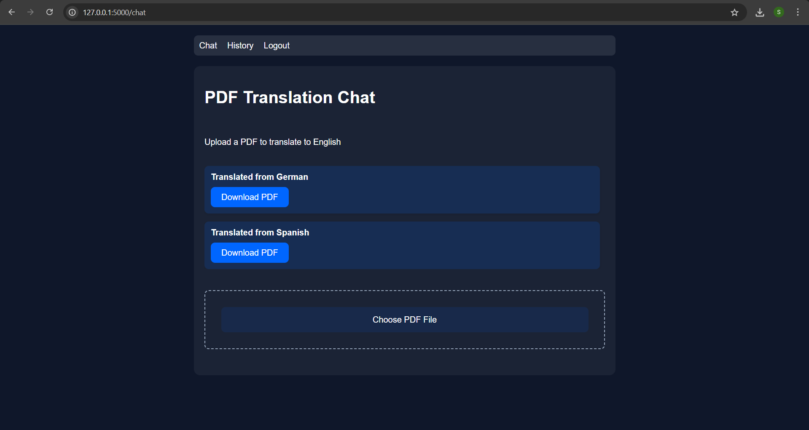

# PDF Translation Chatbot



A web application that translates PDF documents from multiple languages to English, with user authentication and chat history features.

## Features

- 📄 Upload PDFs in 6 languages (German, Finnish, Spanish, Hindi, French, Italian)
- 🔄 Automatic language detection
- 📝 Text extraction and translation to English
- 📥 Download translated PDFs
- 👤 User authentication (login/register)
- 🕒 Translation history tracking
- 🎨 Sleek Dark Mode UI with DeepSeek-inspired design

## Supported Languages

| Language | Code |
|----------|------|
| German   | de   |
| Finnish  | fi   |
| Spanish  | es   |
| Hindi    | hi   |
| French   | fr   |
| Italian  | it   |

## Installation

1. **Clone the repository**
   ```bash
   git clone https://github.com/yourusername/pdf-translation-chatbot.git
   cd pdf-translation-chatbot